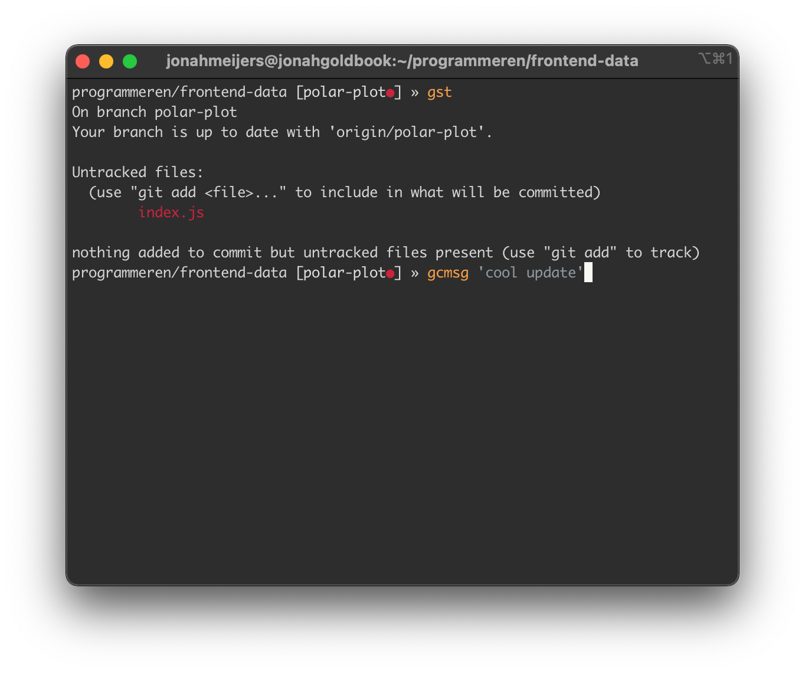

# Dotfiles

## Dotfiles in repository
- zshrc
- eslintrc
- eslintignore
- gitignore
- editorconfig
- iterm-config.json

## Theming
**Theme**: [Rainglow Halflife](https://github.com/rainglow)
**Font**: [Inconsolata/Ligconsolata](https://github.com/googlefonts/Inconsolata)

## Terminal example
  
> [iTerm](https://www.iterm2.com) using the [Rainglow Halflife theme](https://github.com/rainglow).
