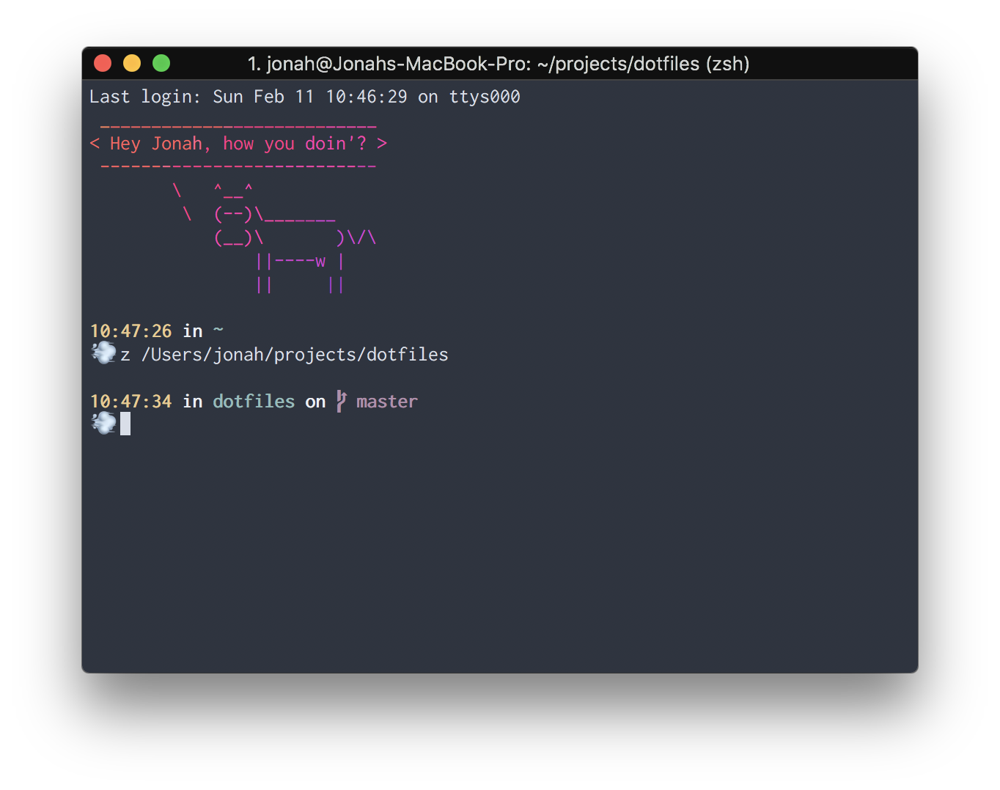

# My own dotfiles

Dotfiles are awesome! They give that extra bit of personality to mundane stuffs on a computer.

The dotfiles that I use are uploaded into this project and updated regularly to reflect the ones I have on my system. The dotfiles I mostly customise and use are:

- .zshrc
- .eslintrc

It's not much, but you gotta start somewhere right? Right?!

I included some very handy dandy install scripts inside the different folders to get you up and running with my setup!

Oh yeah, before I forget. The themes I use for literally everything is called [Nord](https://arcticicestudio.github.io/nord/). I think it's pretty neat!

  
> [iTerm2](https://www.iterm2.com/) using the [Nord theme](https://github.com/arcticicestudio/nord-iterm2)

Have fun! 😊