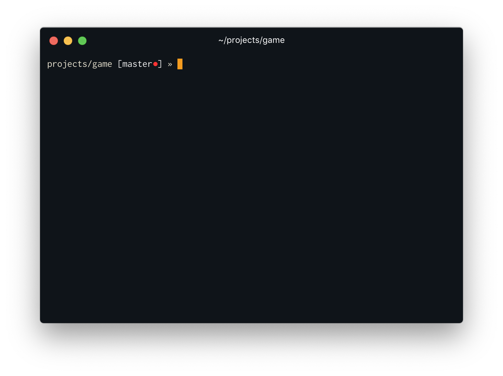

# Dotfiles

## Dotfiles in repository
- .zshrc
- .prettierrc
- .huskyrc
- .lintstagedrc

## Theming
**Theme**: [Ayu](https://github.com/ayu-theme) (switching between 'light' and 'mirage' version when I feel like it)
**Font**: [Inconsolata/Ligconsolata](https://github.com/googlefonts/Inconsolata)

## Terminal example
  
> [Hyper](https://www.hyper.is/) using the [Ayu Mirage theme](https://github.com/weirdpattern/hyper-ayu-mirage)
